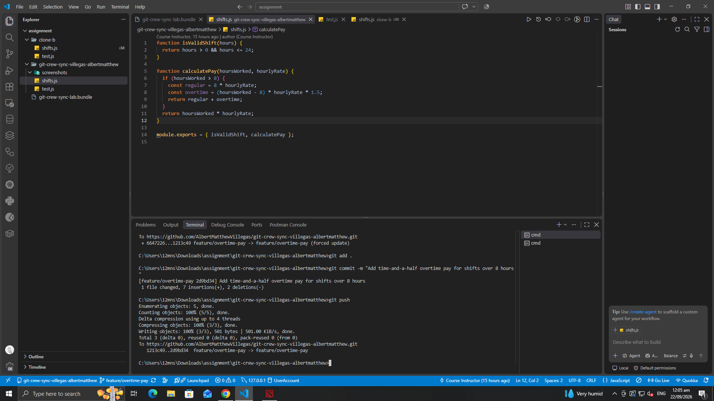
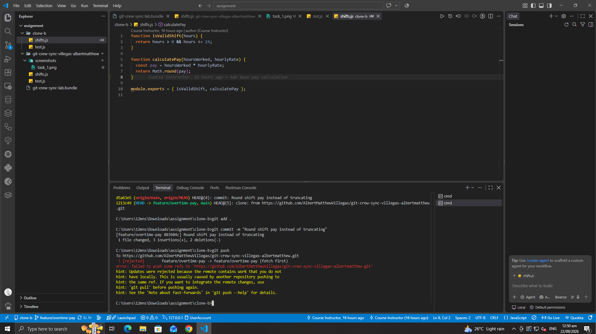
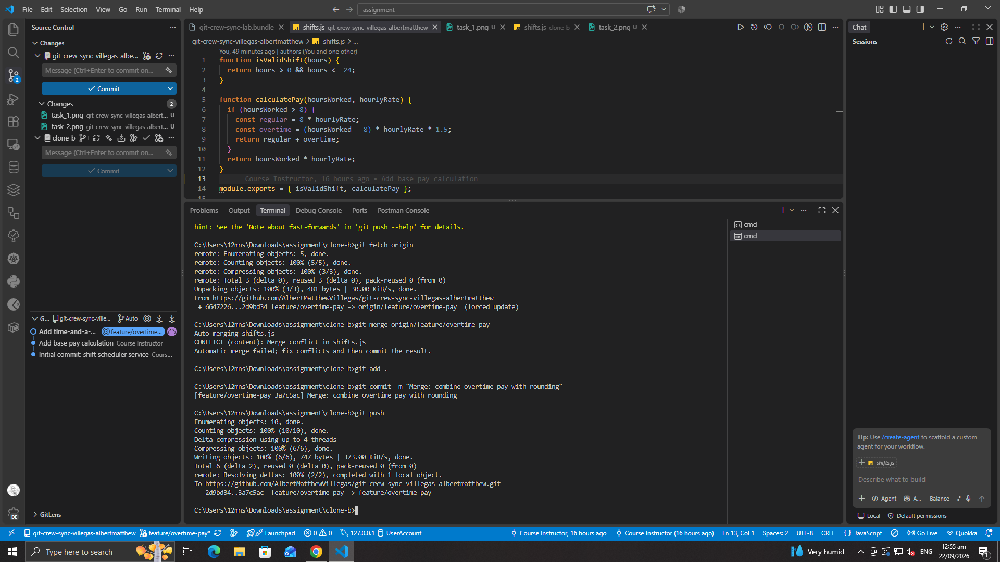
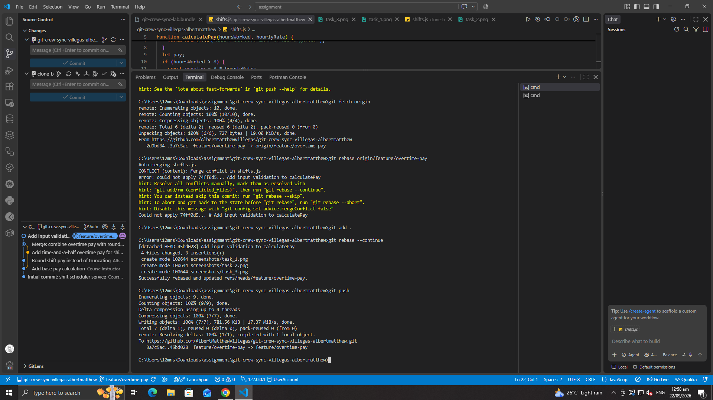
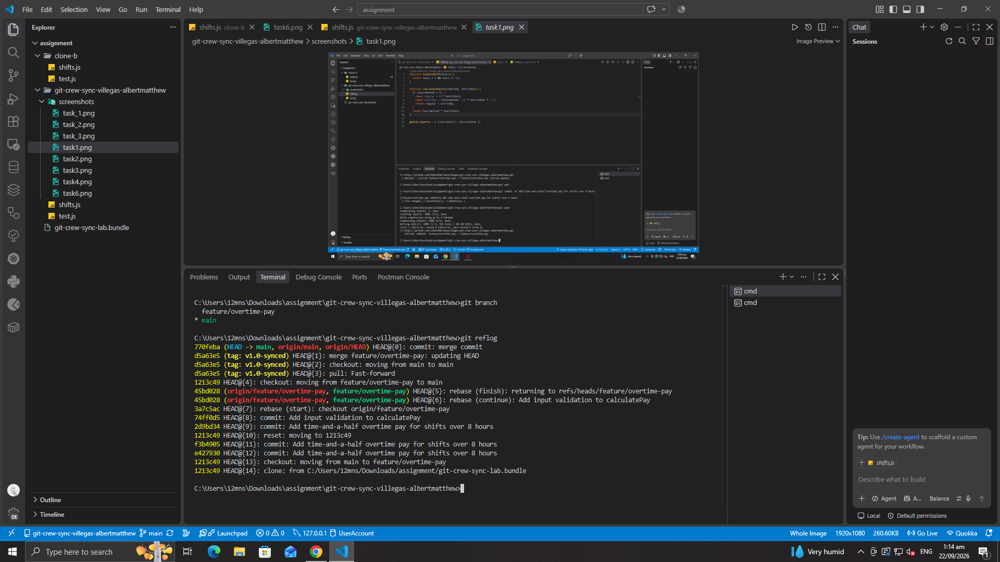
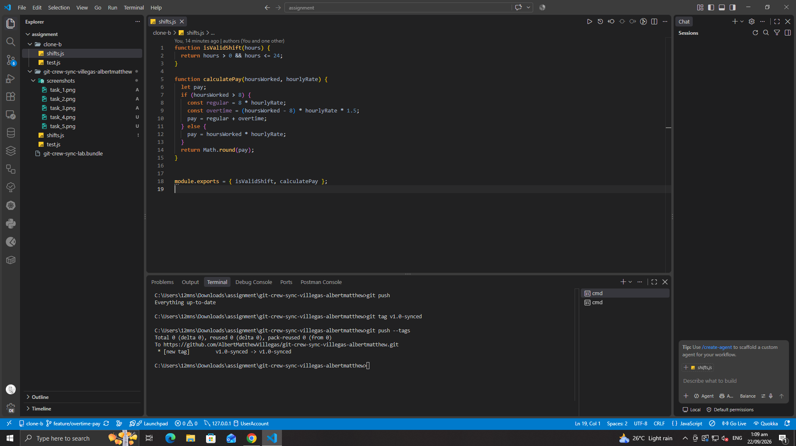

# Workflow Log

## Task 1: Push from Clone A

## Task 2: Diverge from Clone B — rejected

## Task 3: Reconcile with a merge

## Task 4: Diverge again — reconcile with a rebase

## Task 5: Merge into main

## Task 6: Tag and push

## Reflection

**1. What did the rejected push error message tell you, and why did it happen?**
Git rejected the push because the remote had commits I didn't have locally — the other clone had already pushed to the same branch. Git blocks non-fast-forward pushes so you can't accidentally overwrite someone else's work.

**2. What's the actual difference between how you resolved Task 3 (merge) vs Task 4 (rebase)?**
Merge created a new commit joining both histories, preserving the branch exactly as it happened. Rebase rewrote my commit to sit on top of the remote's history instead, giving a linear log with no merge commit. Rebase changes commit hashes, so it's only safe on commits that haven't been pushed/shared yet.

**3. What one habit would have avoided both rejected pushes in this lab?**
Running `git fetch` before starting new work and before pushing, to catch divergence early instead of building on a stale local branch.

**4. Which approach — merge or rebase — would you default to on a shared team branch, and why?**
Merge. Rebasing rewrites history that others may have already pulled, forcing everyone to reconcile a rewritten timeline. Merge is a bit noisier but never requires force-pushing or untangling rewritten commits. Rebase is better suited to cleaning up local commits before they're shared.